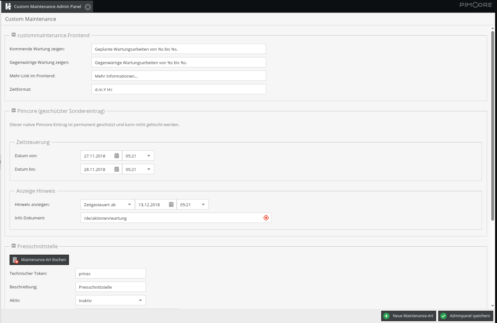
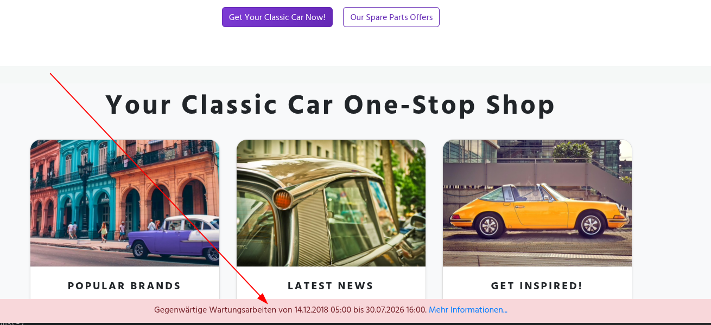

# Custom Maintenance Bundle



Das Bundle ermöglicht fein granulierte Maintenance-Zustände für Pimcore-basierte Anwendungen. Neben der nativen Pimcore-Maintenance können eigene fachliche Maintenances definiert, geplant, manuell geschaltet und im Anwendungscode oder Frontend ausgewertet werden.

Der aktuelle Stand dieses Repositories zielt auf Pimcore `11.x`.
Für Pimcore 10.x existiert ein eigener Branch: https://github.com/weblizards-gmbh/custom-maintenance-bundle/tree/Pimcore-10.x

## Installation

```bash
composer require weblizards/custom-maintenance-bundle
```

Anschließend das Bundle in Pimcore aktivieren.
Hierzu folgende Zeile in `config/bundles.php` hinzufügen:

```php
return [
    // ...
    \Weblizards\CustomMaintenanceBundle\WeblizardsCustomMaintenanceBundle::class => ['all' => true],
];
```

Dann das Bundle installieren:

```shell
bin/console pimcore:bundle:install WeblizardsCustomMaintenanceBundle
```

Nun die Migrations ausführen:

```shell
bin/console doctrine:migrations:migrate "Weblizards\CustomMaintenanceBundle\Migrations\Version20260713114100"
```

## Konfiguration

Die kanonische Persistenz liegt im Pimcore Settings Store.

Rolling-Migration-Verhalten:

- Lesend: `Settings Store -> Legacy-PHP-Datei -> Default`
- Schreibend: immer `Settings Store`
- Sichtbar für Administratoren: keine separate Migrationsaktion im UI
- Legacy-Datei: nur Read-Fallback für bestehende Installationen oder initiale Installationsdefaults

Der Settings-Store-Eintrag wird unter folgendem Scope und Key gehalten:

```text
scope: weblizards_custom_maintenance
key: config
```

Die Legacy-Datei liegt weiterhin unter:

```text
PIMCORE_PRIVATE_VAR . '/config/custommaintenance.php'
```

Wenn weder Settings Store noch Legacy-Datei Bundle-Konfiguration enthalten, erzeugt das Bundle einen konservativen Default nur mit der nativen `pimcore`-Maintenance; es werden keine weiteren Custom-Maintenance-Arten implizit angelegt. Die Installationsdefaults dafür liegen unter `src/CustomMaintenanceBundle/Resources/install/custommaintenance.php`.

Die fachliche Struktur basiert auf:

- `frontend` für Hinweistexte, Link-Beschriftung und Datums-/Zeitformat
- `pimcore` für die native Pimcore-Maintenance
- `custom` für beliebig viele eigene Maintenance-Arten

### Konfigurationsmöglichkeiten

Im aktuellen Stand lassen sich insbesondere diese Bereiche konfigurieren:

- `frontend.indication_upcoming.de` und `frontend.indication_current.de` für die Texte geplanter bzw. aktueller Hinweise
- `frontend.more.de` für die Beschriftung des optionalen Mehr-Links
- `frontend.fulltimeformat.de` für das Ausgabeformat von Datum und Uhrzeit
- `pimcore.show_info`, `pimcore.show_info_from`, `pimcore.planned.from`, `pimcore.planned.to`, `pimcore.document` für den nativen Pimcore-Sonderfall
- `custom.<token>.active`, `custom.<token>.fixed`, `custom.<token>.description`, `custom.<token>.show_info`, `custom.<token>.show_info_from`, `custom.<token>.planned`, `custom.<token>.document` für jede eigene Maintenance-Art

Für `show_info` sind im aktuellen Verhalten insbesondere die Werte `never`, `always` und `automatic` relevant.

Neue Custom-Maintenance-Arten starten mit konservativen Defaults:

- `active: false`
- `fixed: false`
- `show_info: never`
- Datums- und Zeitfelder leer

Der Token `pimcore` ist reserviert. Die native Pimcore-Maintenance ist ein geschützter Sondereintrag und kann nicht gelöscht werden.

Wichtig: Die Maintenances werden im aktuellen Stand **nicht** über eine Symfony- oder YAML-Datei konfiguriert. `services.yml` konfiguriert nur Service-Wiring und die Pfade der Standard-Twig-Templates.

Die fachlichen Daten entstehen über das Admin-Panel beziehungsweise über die gemeinsame Service-Logik und werden anschließend im Pimcore Settings Store abgelegt. Dort liegt der Payload serialisiert als JSON-String.

Beispiel des gespeicherten Payloads:

```json
{
  "frontend": {
    "indication_upcoming": {
      "de": "Geplante Wartungsarbeiten von %s bis %s."
    },
    "indication_current": {
      "de": "Gegenwärtige Wartungsarbeiten von %s bis %s."
    },
    "more": {
      "de": "Mehr Informationen..."
    },
    "fulltimeformat": {
      "de": "d.m.Y H:i"
    }
  },
  "pimcore": {
    "show_info": "never",
    "show_info_from": {
      "date": "20.12.2018",
      "time": "12:21"
    },
    "planned": {
      "from": {
        "date": "04.12.2018",
        "time": "12:21"
      },
      "to": {
        "date": "05.12.2018",
        "time": "12:21"
      }
    },
    "document": "/de/maintenance/pimcore"
  },
  "custom": {
    "prices": {
      "active": "false",
      "fixed": "false",
      "description": "ERP",
      "show_info": "never",
      "show_info_from": {
        "date": "21.12.2018",
        "time": "00:00"
      },
      "planned": {
        "from": {
          "date": "21.12.2018",
          "time": "12:00"
        },
        "to": {
          "date": "28.12.2018",
          "time": "23:00"
        }
      },
      "document": "/de/maintenance/erp"
    }
  }
}
```

### Was in YAML konfiguriert werden kann

Eine YAML-Datei wird im aktuellen Stand nicht für die fachliche Maintenance-Konfiguration verwendet, aber für die statische Bundle-Konfiguration.

Derzeit lässt sich darüber insbesondere die Zuordnung der Standard-Twig-Templates für die Hinweis-Ausgabe konfigurieren. Diese Werte gehören in die Anwendungskonfiguration, zum Beispiel nach `config/packages/weblizards_custom_maintenance.yaml`.

Beispiel:

```yaml
weblizards_custom_maintenance:
  notice_templates:
    upcoming: '@WeblizardsCustomMaintenance/partials/indicateupcoming.html.twig'
    current: '@WeblizardsCustomMaintenance/partials/indicatecurrent.html.twig'
```

Wichtig dabei:

- Diese YAML-Konfiguration betrifft die statische Bundle-Konfiguration, nicht die inhaltlichen Maintenance-Daten.
- Die eigentlichen Maintenance-Daten unter `frontend`, `pimcore` und `custom` werden weiterhin im Settings Store beziehungsweise aus dem Legacy-Fallback geladen.
- `services.yml` im Bundle verdrahtet diese konfigurierten Werte nur noch in den `StatusService`.

### Pflege der Konfiguration

Die Konfiguration kann auf mehreren Wegen genutzt oder verändert werden:

- über das Pimcore-Admin-Panel des Bundles für `frontend`, `pimcore` und `custom`
- programmatisch über den `StatusService` für Statuswechsel von Custom-Tokens
- indirekt über die Rolling Migration, wenn bestehende Legacy-Konfigurationen beim ersten erfolgreichen Schreibvorgang in den Settings Store übernommen werden

## Twig-Nutzung

Hinweise können über die vorhandenen Twig-Funktionen eingebunden werden:

```twig
{{ indicateCustomMaintenance() }}
{{ indicateUpcomingMaintenance() }}
{{ indicateCurrentMaintenance() }}
```

Das Bundle liefert dafür zwei kanonische Twig-Standard-Templates unter `@WeblizardsCustomMaintenance/partials/indicateupcoming.html.twig` und `@WeblizardsCustomMaintenance/partials/indicatecurrent.html.twig`.

Die Hinweis-Ausgabe setzt dabei ausschließlich auf Twig; ein PHP-Template-Pfad wird für diese Standard-Hinweise nicht mehr verwendet oder vorausgesetzt.



Die Standardpfade können über die Bundle-Konfiguration unter `weblizards_custom_maintenance.notice_templates` gezielt auf andere Twig-Templates umgebogen werden.

Den Status einzelner Maintenances können Anwendungen über Twig ebenfalls prüfen:

```twig

    {# degradiertes Verhalten #}

```

Die Twig-Funktion `isMaintenanceActive()` delegiert dabei direkt an denselben `StatusService`-Pfad wie die PHP-Nutzung.

## PHP-API

Die zentrale Runtime-API liegt im `StatusService`.

- `getValidTokens()` liefert die Custom-Tokens.
- `getStatus($token)` liefert den gespeicherten Status (`true` oder `false` als String-Konstanten des Services) für einen Custom-Token; `pimcore` ist hier absichtlich kein gültiger Token.
- `setStatus($token, $state, $overrideFixed = false)` setzt den Status für einen Custom-Token; `fixed`-Maintenances können optional explizit übersteuert werden, `pimcore` jedoch nicht.
- `isActive($token)` prüft, ob eine Maintenance aktiv ist; ohne Argument wird über alle konfigurierten Tokens ausgewertet, der reservierte Token `pimcore` wird dabei übersprungen.
- `isFixedMode()`, `isHandsOff()`, `showUpcoming()`, `getDocumentPath()`, `getMaintenanceFrom()`, `getMaintenanceTo()` und `getConfigForToken()` arbeiten auf Maintenance-Entries und akzeptieren daher sowohl Custom-Tokens als auch den reservierten Token `pimcore`.
- Unbekannte oder gelöschte Tokens bleiben ein Fehlerpfad und werden zusätzlich im Anwendungslog auf Fehlerniveau protokolliert.

Beispiel:

```php
<?php

declare(strict_types=1);

namespace App\Controller;

use Pimcore\Controller\FrontendController;
use Weblizards\CustomMaintenanceBundle\Service\StatusService;

class DefaultController extends FrontendController
{
    public function defaultAction(StatusService $status): void
    {
        $this->view->preventLogin = $status->isActive('prices');
    }
}
```

## CLI

Die CLI-Steuerung läuft über den Command:

```bash
bin/console weblizards:custommaintenance:control list-tokens
bin/console weblizards:custommaintenance:control show-status --token=prices
bin/console weblizards:custommaintenance:control activate --token=prices
bin/console weblizards:custommaintenance:control deactivate --token=prices
```

Optional:

- `--porcelain` für maschinenlesbare Ausgabe
- `--override-fixed` zum Übersteuern des `fixed`-Schutzes

Die CLI arbeitet dabei auf derselben gemeinsamen Konfigurations- und Statuslogik wie Twig und PHP-Runtime.

## Entwicklung und Tests

- PHPUnit ist über `composer test` bzw. `vendor/bin/phpunit` vorgesehen.
- Hinweise zur lokalen Pimcore-Einbindung und Verifikation stehen in [docs/development_testing.md](docs/development_testing.md).
- Für bestehende Installationen ist keine manuelle Datenmigration erforderlich; beim ersten erfolgreichen Schreibvorgang wird der kanonische Stand in den Settings Store geschrieben.
